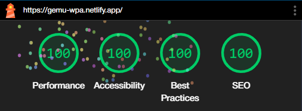

<p align="center">
  </img>

  <h1 align="center">
    🎮 Gemu 📱
  </h1>
</p>

**[Gemu](https://gemu-wpa.netlify.app)** est une Progressive Web App (PWA) qui permet de vérifier si un studio de développement de jeux vidéo est éthique et respectueux de ses employés. Elle utilise HTML, CSS, Vite et Node.js. </br>
Elle a comme but d'être l'équivalent de [Yuka](https://yuka.io) pour l'industrie du jeu vidéo.

## Description
Dans un monde où on admet que le code-barre des jeux physiques est lisible par l'application, **Gemu** permet de scanner le code-barre d'un jeu vidéo pour obtenir des informations sur le studio de développement qui l'a créé. L'application utilise l'API de Steam pour obtenir les informations sur le jeu. </br>
On admet également que l'éthique du studio est liée à une base donnée pour savoir si le studio est éthique ou non (c'est actuellement choisi de manière aléatoire).

## Fonctionnalités
- Utilisation des caméras
- Scan de QR Code/Code-barres
- Liaison à une API pour les données du jeu
- Mobile-first

## Améliorations possibles
- Liaison à une base de données pour l'éthique des studios de développement
- Fournir une liste de preuves pour les studios non éthiques
- Meilleure interface utilisateur (scanner de code-barres, affichage des informations)

## Utilisation
1. Ouvrir le site [Gemu](https://gemu-wpa.netlify.app) ou la PWA sur un appareil mobile.
2. Cliquer sur le bouton "Scanner un code-barres".
3. Scanner un des codes-barres/QR codes présents dans le dosser [samples](./samples/).
4. Regarder les informations.

## Installation & Déploiement
### Installation
```bash
npm install
```

### Déploiement
```bash
npm run build
```

## LightHouse
